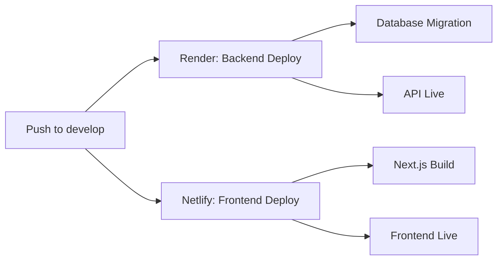

# Build & Deployment Guide

This guide explains how to deploy Project Template to production using **Netlify** for the frontend and **Render** for the backend.

## Table of Contents

- [Overview](#overview)
- [Prerequisites](#prerequisites)
- [Backend Deployment (Render)](#backend-deployment-render)
- [Frontend Deployment (Netlify)](#frontend-deployment-netlify)
- [Environment Variables](#environment-variables)
- [Deployment Workflow](#deployment-workflow)
- [Troubleshooting](#troubleshooting)

---

## Overview

Project Template uses a **split deployment architecture**:

- **Frontend (Next.js)** → Deployed to **Netlify**
  - Automatic builds from `develop` branch
  - Edge caching and CDN distribution
  - Serverless functions for SSR

- **Backend (NestJS)** → Deployed to **Render**
  - PostgreSQL database included
  - Automatic migrations on deploy
  - Health checks and zero-downtime deploys

Both platforms detect their respective configuration files automatically:

- Netlify uses `netlify.toml`
- Render uses `render.yaml`

---

## Prerequisites

Before deploying, ensure you have:

1. **GitHub Account** with the repository pushed
2. **Netlify Account** ([Sign up](https://app.netlify.com/signup))
3. **Render Account** ([Sign up](https://dashboard.render.com/register))
4. **Environment Variables** prepared (see [Environment Variables](#environment-variables))

---

## Backend Deployment (Render)

Render uses the `render.yaml` blueprint file to automatically provision all required infrastructure.

### What Gets Created

The `render.yaml` file defines:

```yaml
services:
  - type: web # NestJS API server
    name: project-template-api
    runtime: node
    plan: free

databases:
  - name: project-template-db # PostgreSQL database
    databaseName: project_template_manager
    user: project_template_user
    plan: free
```

NEXT_PUBLIC_API_URL = https://project-template-api.onrender.com

````

#### Option 1: Blueprint (Recommended)

1. **Connect Repository to Render**
 - Go to [Render Dashboard](https://dashboard.render.com/)
 - Click **"New +"** → **"Blueprint"**
 - Connect your GitHub account
- Select the `project-template` repository
 - Select branch: `develop`

2. **Render Auto-Detects Configuration**
 - Render will find `render.yaml` in the repository root
 - Review the services to be created:
  - `project-template-api` (Web Service)
  - `project-template-db` (PostgreSQL Database)

3. **Set Environment Variables**

 Render will prompt for any variables with `generateValue: true` or `sync: false`. You'll need to set:
 - `JWT_SECRET` - Auto-generated or provide your own secure key

4. **Deploy**
 - Click **"Apply"**
 - Render will automatically:
   - Install dependencies (`pnpm install`)
   - Generate Prisma Client
   - Run database migrations
   - Build the NestJS application
   - Start the server

5. **Verify Deployment**
 - Check logs in Render Dashboard
- Visit: `https://project-template-api.onrender.com/api` (Swagger docs)
- Check health: `https://project-template-api.onrender.com/api`

#### Option 2: Manual Setup

If you prefer manual setup instead of Blueprint:

1. **Create PostgreSQL Database**
- New → PostgreSQL
- Name: `project-template-db`
 - Region: Oregon (or your preference)
 - Plan: Free

2. **Create Web Service**
 - New → Web Service
 - Connect repository
 - Configuration:
   ```
  Name: project-template-api
   Region: Oregon
   Branch: develop
   Runtime: Node
  Build Command: corepack enable && corepack prepare pnpm@9.14.4 --activate && pnpm install --frozen-lockfile && pnpm exec prisma generate --schema=apps/backend-rest/prisma/schema.prisma && pnpm exec prisma migrate deploy --schema=apps/backend-rest/prisma/schema.prisma && pnpm turbo build --filter=@project-template/backend-rest
   Start Command: cd apps/backend-rest && pnpm run start:prod
   ```

3. **Set Environment Variables** (see below)

### Build Process Explained

The `render.yaml` configures this build pipeline:

```yaml
buildCommand: |
pnpm install --frozen-lockfile &&                 # Install all monorepo dependencies
pnpm exec prisma generate --schema=apps/backend-rest/prisma/schema.prisma &&  # Generate Prisma Client
pnpm exec prisma migrate deploy --schema=apps/backend-rest/prisma/schema.prisma &&  # Run migrations
pnpm turbo build --filter=@project-template/backend-rest   # Build backend with Turborepo
```

**Key Points:**

- Uses `pnpm turbo build --filter` to build only the backend in monorepo
- Prisma migrations run automatically before build
- `@nestjs/cli` is in `dependencies` (not `devDependencies`) for production builds

### Auto-Deploy Behavior

```yaml
branch: develop
```

Render automatically deploys when you push to the `develop` branch.

---

## Frontend Deployment (Netlify)

Netlify uses the `netlify.toml` file to configure the Next.js build and deployment.

### What the Configuration Does

The `netlify.toml` file defines:

```toml
[build]
base = "."
command = "pnpm install --frozen-lockfile && pnpm turbo build --filter=@project-template/frontend..."
publish = "apps/frontend/.next"

[build.environment]
NODE_VERSION = "22.0.0"
NPM_VERSION = "10.9.0"
```

**Explanation:**

- `base = "."` - Build from repository root
- `command` - Installs dependencies and builds frontend with Turborepo
- `publish` - Points to Next.js build output directory
- `--filter=@project-template/frontend...` - Builds frontend and its dependencies

### Deployment Steps

1. **Connect Repository to Netlify**
 - Go to [Netlify Dashboard](https://app.netlify.com/)
 - Click **"Add new site"** → **"Import an existing project"**
 - Choose **GitHub**
- Select the `project-template` repository

2. **Netlify Auto-Detects Configuration**
 - Netlify will find `netlify.toml` automatically
 - Configuration is imported from the file
 - No manual settings needed!

3. **Configure Environment Variables**

 In Netlify Dashboard → Site Settings → Environment Variables:

```
NEXT_PUBLIC_API_URL = https://project-template-api.onrender.com
```

 This tells the frontend where to find the backend API.

4. **Deploy**
 - Click **"Deploy site"**
 - Netlify will:
   - Install dependencies from monorepo root
   - Build UI packages
   - Build Next.js app with Turborepo
   - Deploy to CDN

5. **Verify Deployment**
 - Visit your Netlify URL (e.g., `https://your-site.netlify.app`)
 - Check that API calls connect to backend

### Next.js Plugin

The `netlify.toml` includes:

```toml
[[plugins]]
package = "@netlify/plugin-nextjs"
```

This plugin automatically:

- Handles Next.js SSR and API routes
- Optimizes images with Netlify Image CDN
- Configures serverless functions
- Enables ISR (Incremental Static Regeneration)

### Build Filtering

The build command uses Turborepo's dependency-aware filtering:

```bash
turbo build --filter=@project-template/frontend...
```

The `...` suffix means: **build @project-template/frontend AND all packages it depends on**.

This ensures:

1. `packages/ui` builds first
2. `apps/frontend` builds with the compiled UI package

---

## Environment Variables

### Backend (Render)

Set these in Render Dashboard or via `render.yaml`:

| Variable         | Value          | Source                                 |
| ---------------- | -------------- | -------------------------------------- |
| `NODE_ENV`       | `production`   | Hardcoded in `render.yaml`             |
| `PORT`           | `10000`        | Hardcoded (Render default)             |
| `DATABASE_URL`   | Auto-generated | From `project-template-db` database             |
| `JWT_SECRET`     | Auto-generated | `generateValue: true` in `render.yaml` |
| `JWT_EXPIRATION` | `7d`           | Hardcoded in `render.yaml`             |

**Note:** `DATABASE_URL` is automatically linked in `render.yaml`:

```yaml
- key: DATABASE_URL
fromDatabase:
  name: project-template-db
  property: connectionString
```

### Frontend (Netlify)

Set these in Netlify Dashboard → Site Settings → Environment Variables:

| Variable              | Value                              | Required |
| --------------------- | ---------------------------------- | -------- |
| `NEXT_PUBLIC_API_URL` | `https://project-template-api.onrender.com` | ✅       |

**Important:** Variables prefixed with `NEXT_PUBLIC_` are exposed to the browser.

### Turborepo Remote Caching (Optional)

For faster builds, enable Turborepo remote caching:

**Netlify:**

```toml
[build.environment]
TURBO_TOKEN = "${TURBO_TOKEN}"
TURBO_TEAM = "${TURBO_TEAM}"
```

**Render:**

```yaml
envVars:
- key: TURBO_TOKEN
  value: your-token
- key: TURBO_TEAM
  value: your-team
```

Get these from [Vercel Dashboard](https://vercel.com/account/tokens).

---

## Deployment Workflow

### Automatic Deployments

Both platforms deploy automatically when you push to `develop`:



### Manual Deployments

**Render:**

1. Go to service in Render Dashboard
2. Click **"Manual Deploy"** → **"Deploy latest commit"**

**Netlify:**

1. Go to site in Netlify Dashboard
2. Click **"Deploys"** → **"Trigger deploy"**

### Deployment Checklist

Before deploying:

- [ ] All tests passing locally
- [ ] Database migrations tested
- [ ] Environment variables configured
- [ ] API and frontend URLs match
- [ ] CORS configured in backend for frontend URL

---

## Troubleshooting

### Backend Issues

#### Build Fails with "nest: not found"

**Problem:** The `@nestjs/cli` isn't available during build.

**Solution:** Verify in `apps/backend-rest/package.json`:

```json
{
"dependencies": {
  "@nestjs/cli": "^10.4.9" // Must be in dependencies, not devDependencies
},
"scripts": {
  "build": "npx nest build" // Use npx to ensure local CLI is used
}
}
```

#### Database Connection Fails

**Problem:** `DATABASE_URL` not set or invalid.

**Solution:**

1. Check Render Dashboard → Service → Environment
2. Verify `DATABASE_URL` is linked to database
3. Test connection in Shell:
 ```bash
 cd apps/backend-rest
 npx prisma db push
 ```

#### Migrations Fail

**Problem:** Migration errors during deployment.

**Solution:**

```bash
# In Render Shell
cd apps/backend-rest
npx prisma migrate reset  # ⚠️ Deletes all data
npx prisma migrate deploy
```

### Frontend Issues

#### Build Fails with Module Not Found

**Problem:** Turborepo not building dependencies.

**Solution:** Check build command in `netlify.toml`:

```toml
command = "pnpm install --frozen-lockfile && pnpm turbo build --filter=@project-template/frontend..."
```

The `...` suffix is critical - it builds dependencies.

#### API Calls Fail (404/CORS)

**Problem:** Frontend can't reach backend.

**Solutions:**

1. Verify `NEXT_PUBLIC_API_URL` in Netlify environment variables
2. Check CORS in `apps/backend-rest/src/main.ts`:
 ```typescript
 app.enableCors({
   origin: process.env.FRONTEND_URL || '*',
 });
 ```
3. Set `FRONTEND_URL` in Render environment variables

#### Next.js Plugin Issues

**Problem:** SSR not working, routes returning 404.

**Solution:**

1. Verify plugin in `netlify.toml`:
 ```toml
 [[plugins]]
   package = "@netlify/plugin-nextjs"
 ```
2. Check Netlify Functions logs for errors

### General Issues

#### Node Version Mismatch

**Problem:** Build fails with version incompatibility.

**Solutions:**

**Render:** Render uses Node 22 by default (matches requirement)

**Netlify:** Set in `netlify.toml`:

```toml
[build.environment]
NODE_VERSION = "22.0.0"
```

#### Slow Builds

**Problem:** Builds taking 5+ minutes.

**Solution:** Enable Turborepo remote caching (see Environment Variables section).

---

## Additional Resources

- [Render Documentation](https://render.com/docs)
- [Render Blueprint Spec](https://render.com/docs/blueprint-spec)
- [Netlify Next.js Guide](https://docs.netlify.com/frameworks/next-js/overview/)
- [Netlify Configuration Reference](https://docs.netlify.com/configure-builds/file-based-configuration/)
- [Turborepo Filtering](https://turbo.build/repo/docs/core-concepts/monorepos/filtering)
- [RENDER_DEPLOYMENT.md](./RENDER_DEPLOYMENT.md) - Detailed Render guide

---

## Quick Reference

### Render URLs

- Dashboard: https://dashboard.render.com/
- API (Production): https://project-template-api.onrender.com
- Swagger Docs: https://project-template-api.onrender.com/api

### Netlify URLs

- Dashboard: https://app.netlify.com/
- Site: https://your-site-name.netlify.app

### Important Files

- `render.yaml` - Render infrastructure configuration
- `netlify.toml` - Netlify build configuration
- `turbo.json` - Turborepo pipeline definition
- `apps/backend-rest/package.json` - Backend dependencies
- `apps/frontend/package.json` - Frontend dependencies
````
